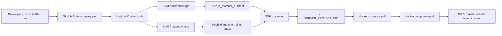

# CI/CD Pipeline

這份文件描述目前 `jd_matcher_ai` 專案的 CI/CD 部署流程，目標是讓後續開發者一眼看懂：

- 程式碼從哪裡進來
- GitHub Actions 做了什麼
- Docker Hub 扮演什麼角色
- 伺服器怎麼更新容器
- 哪些環境設定還需要手動完成

這份文件聚焦在「更新部署架構」，不解釋應用功能本身；應用分層與資料流請參考 `docs/system_design.md`。

## 1. 部署目標

目前 CI/CD 的目標流程是：

```text
git push to main
-> GitHub Actions
-> build Docker images
-> push images to Docker Hub
-> SSH into server
-> docker compose pull
-> docker compose up -d
-> server runs latest containers
```

這代表未來日常更新不應再依賴：

- 在伺服器上手動 `git pull`
- 在伺服器上手動 `docker build`
- 在伺服器上保留一份可編譯的原始碼作為唯一部署來源

部署的真實來源會變成 Docker Hub 上的 image。

## 2. CI/CD 架構總覽

### 2.1 整體部署資料流



### 2.2 與現有系統設計的關係

這個部署流程是沿用目前系統架構，而不是改寫架構：

- backend 仍是 FastAPI
- frontend 仍是 Streamlit
- MySQL / Redis / phpMyAdmin 仍由 docker compose 管理
- `docker-compose.yml` 仍是伺服器的部署入口
- 只是 `api` 與 `frontend` 不再在 server 本地 build，而是改成 pull image

這樣的做法符合 `system_design.md` 的分層原則，也避免部署邏輯侵入應用程式邏輯。

## 3. 目前實作完成的部署元件

### 3.1 Backend image

使用根目錄 `Dockerfile` 建立 backend image。

目前 backend image tag：

```text
<dockerhub_username>/jd_matcher_ai:latest
```

用途：

- 提供 FastAPI API 容器使用
- 作為 GitHub Actions build/push 的主要後端映像

### 3.2 Frontend image

使用 `ui/Dockerfile` 建立 frontend image。

目前 frontend image tag：

```text
<dockerhub_username>/jd_matcher_ai_ui:latest
```

用途：

- 提供 Streamlit UI 容器使用

補充：

- 雖然本次需求主要提到 `jd_matcher_ai:latest`
- 但現有架構是 API 與 UI 兩個獨立容器
- 如果只部署 backend image，UI 仍會停留在舊版本
- 所以目前 CI/CD 會同時 build 與 deploy backend 和 frontend 兩個 image

### 3.3 Docker Compose 部署模式

目前 `docker-compose.yml` 已改成 image-based deployment。

關鍵點：

- `api` 改為使用：`${DOCKERHUB_USERNAME}/jd_matcher_ai:latest`
- `frontend` 改為使用：`${DOCKERHUB_USERNAME}/jd_matcher_ai_ui:latest`
- `pull_policy: always`
- 伺服器執行 `docker compose pull` 時會拉最新 image

仍保留的服務：

- `mysql`
- `redis`
- `phpmyadmin`

也就是說，只有應用層服務改成遠端 image 部署，資料層與管理工具仍由 compose 維持。

## 4. GitHub Actions Workflow 說明

目前 workflow 檔案：

- `.github/workflows/deploy.yml`

觸發條件：

```yaml
on:
  push:
	 branches:
		- main
```

也就是每次 push 到 `main`，都會觸發完整部署流程。

### 4.1 Step 1: Checkout

使用：

- `actions/checkout@v4`

用途：

- 把 GitHub repository 內容抓到 runner
- 作為後續 Docker build context

### 4.2 Step 2: Validate CI/CD configuration

這一步不是平台必要步驟，但目前有實作，目的是讓 workflow 在最前面就 fail fast。

會檢查是否存在：

- `DOCKERHUB_USERNAME`
- `DOCKERHUB_TOKEN`
- `SERVER_HOST`
- `SERVER_USER`
- `SERVER_PORT`
- `SERVER_SSH_KEY`
- `SERVER_PROJECT_DIR`

如果其中一個沒有設定，workflow 會直接失敗，不會等到 build 或 SSH 階段才報錯。

### 4.3 Step 3: Login to Docker Hub

使用：

- `docker/login-action@v3`

登入資訊來自 GitHub Secrets：

- `DOCKERHUB_USERNAME`
- `DOCKERHUB_TOKEN`

用途：

- 允許 GitHub Actions 推 image 到 Docker Hub

### 4.4 Step 4: Build and push backend image

使用：

- `docker/build-push-action@v6`

設定：

- build context: repository root
- Dockerfile: `./Dockerfile`
- push: `true`
- tag: `${DOCKERHUB_USERNAME}/jd_matcher_ai:latest`

結果：

- 最新 backend 程式會被打包成 image 並推到 Docker Hub

### 4.5 Step 5: Build and push frontend image

使用：

- `docker/build-push-action@v6`

設定：

- build context: repository root
- Dockerfile: `./ui/Dockerfile`
- push: `true`
- tag: `${DOCKERHUB_USERNAME}/jd_matcher_ai_ui:latest`

結果：

- 最新 Streamlit UI 會被打包並推到 Docker Hub

### 4.6 Step 6: Publish build summary

workflow 會把 build 結果寫到 GitHub Actions job summary，讓人快速確認：

- backend image 是否已 push
- frontend image 是否已 push
- 下一步是否進入 deployment

### 4.7 Step 7: SSH Deploy to Server

使用：

- `appleboy/ssh-action@v1.2.0`

SSH 連線資訊來自 GitHub Secrets：

- `SERVER_HOST`
- `SERVER_USER`
- `SERVER_PORT`
- `SERVER_SSH_KEY`

伺服器專案路徑來自 GitHub Variables：

- `SERVER_PROJECT_DIR`

workflow 在 server 上執行的實際指令是：

```bash
cd "$SERVER_PROJECT_DIR"
docker compose pull
docker compose up -d
```

效果：

- 拉下最新 image
- 重新啟動需要更新的 container
- server 轉到最新版本

### 4.8 Step 8: Publish deployment summary

如果部署成功，workflow 會在 summary 內標記 deployment success，方便從 Actions 頁面快速確認整體流程已走完。

## 5. Server 端實際更新架構

### 5.1 Server 上需要存在的東西

伺服器仍然需要有一份部署目錄，至少包含：

- `docker-compose.yml`
- `.env`
- `data/`

原因：

- compose 是 server 上的啟動入口
- `.env` 提供資料庫、Redis、OpenAI、Docker Hub username 等環境變數
- `data/` 保存輸出與履歷資料

### 5.2 Server 上不再需要做的事

在 image-based deployment 模式下，server 不需要再做：

- 本地 `docker build`
- 用 local source code 重新編譯 API / UI

server 只需要：

- 讀 `docker-compose.yml`
- 讀 `.env`
- 從 Docker Hub pull image
- 啟動 / 重啟 containers

### 5.3 資料持久化與 image 的邊界

目前的職責切分如下：

- image：保存應用程式程式碼與執行環境
- `.env`：保存部署環境設定
- MySQL volume：保存資料庫資料
- Redis volume：保存快取資料
- `./data:/app/data`：保存輸出與履歷檔案

這樣更新 image 時，不會把資料庫與輸出內容一起覆蓋掉。

## 6. 錯誤處理與失敗行為

目前 workflow 的失敗行為如下：

- 如果 secrets / variables 沒設：在 validate step 直接 fail
- 如果 Docker Hub login 失敗：workflow fail
- 如果 backend image build 失敗：workflow fail
- 如果 frontend image build 失敗：workflow fail
- 如果 push image 失敗：workflow fail
- 如果 SSH 連線失敗：workflow fail
- 如果 server 上 `docker compose pull` 或 `docker compose up -d` 失敗：workflow fail

這符合預期的 CI/CD 行為：任一關鍵步驟出錯，整個部署中止，不會假裝成功。

## 7. 日誌與可觀察性

目前 GitHub Actions 會清楚顯示：

- repository checkout 完成
- Docker Hub login 完成
- backend image build/push 完成
- frontend image build/push 完成
- deployment 成功完成

目前已具備的觀察面向：

- GitHub Actions step logs
- GitHub Actions job summary
- server 上 `docker compose` 執行結果

後續如果要再提升可觀察性，可以再加：

- image digest 顯示
- deployment 前後容器版本比對
- health check 驗證步驟

## 8. 一眼看懂目前更新部署流程

### 8.1 更新流程精簡版

```text
開發者修改程式
-> git push origin main
-> GitHub Actions 啟動 deploy.yml
-> build backend/frontend images
-> push 到 Docker Hub
-> SSH 到伺服器
-> docker compose pull
-> docker compose up -d
-> API 與 UI 切到最新版本
```

### 8.2 元件職責精簡版

- GitHub：存 source code，觸發 CI/CD
- GitHub Actions：負責自動 build / push / deploy
- Docker Hub：存部署用 images
- Server：負責 pull image 並啟動容器
- Docker Compose：負責編排 API、UI、MySQL、Redis、phpMyAdmin

## 9. 目前尚未完成的環境配置

這一段是後續開發或正式上線前，仍需要手動完成的設定清單。

### 9.1 GitHub Secrets

目前需要在 GitHub repository secrets 內建立：

1. `DOCKERHUB_USERNAME`
	- Docker Hub 帳號名稱

2. `DOCKERHUB_TOKEN`
	- Docker Hub access token
	- 不建議使用帳號密碼

3. `SERVER_HOST`
	- 伺服器 IP 或 domain

4. `SERVER_USER`
	- SSH 登入使用者

5. `SERVER_PORT`
	- SSH port，通常是 `22`

6. `SERVER_SSH_KEY`
	- GitHub Actions 用來登入 server 的 private key

### 9.2 GitHub Variables

目前需要在 GitHub repository variables 內建立：

1. `SERVER_PROJECT_DIR`
	- server 上專案部署目錄
	- 例如：`/opt/jd_matcher_ai`

### 9.3 Docker Hub 設定

目前還需要確認 Docker Hub 端：

1. 已建立 image repository
	- `jd_matcher_ai`
	- `jd_matcher_ai_ui`

2. `DOCKERHUB_TOKEN` 具有 push 權限

3. 如果 repository 是 private：
	- server 端必須先完成 `docker login`
	- 否則 `docker compose pull` 會失敗

### 9.4 Server 端部署目錄

目前還需要手動準備 server 專案目錄，至少包含：

- `docker-compose.yml`
- `.env`
- `data/`

建議目錄結構：

```text
/opt/jd_matcher_ai/
  docker-compose.yml
  .env
  data/
```

### 9.5 Server `.env` 設定

server 上的 `.env` 至少需要包含：

- `DOCKERHUB_USERNAME`
- `MYSQL_DATABASE`
- `MYSQL_USER`
- `MYSQL_PASSWORD`
- `MYSQL_ROOT_PASSWORD`
- `REDIS_URL`
- `OPENAI_API_KEY`
- `API_BASE_URL`
- `RESUME_PATH`
- `OUTPUTS_DIR`

其中關鍵是：

- `DOCKERHUB_USERNAME` 會被 `docker-compose.yml` 用來組 image 名稱
- `API_BASE_URL` 目前給 frontend container 使用
- `OPENAI_API_KEY` 只應存在於 backend server `.env`，不要提交到 repo

### 9.6 Resume 與 data 目錄

目前還需要確認 server 上：

- `data/resume.txt` 已存在
- `data/outputs/` 可寫入

否則 parser / strategy pipeline 在 server 上可能會因為找不到 resume 或無法輸出檔案而失敗。

### 9.7 首次部署初始化

如果是第一次在 server 部署，還需要手動做一次：

```bash
docker compose pull
docker compose up -d
```

原因：

- GitHub Actions 只能更新一個已存在的部署目錄
- 它不會自動幫你建立 server 目錄、上傳 `.env`、初始化 data 目錄

## 10. 後續建議

目前 CI/CD 已可支援自動 build、push、deploy。後續若要提高穩定性，可以考慮：

1. 在 workflow 增加測試步驟，例如 `pytest`
2. 在 deployment 後加入 health check，例如檢查 `/health`
3. 使用 immutable tag，例如 commit SHA，而不只用 `latest`
4. 加入 rollback 策略，避免最新 image 有問題時無法快速回退

## 11. 一句話記住這套部署架構

這套 CI/CD 的核心就是：

`GitHub 管 source，Actions 負責 build 與 deploy，Docker Hub 存 image，Server 用 docker compose pull/up 套用最新版本。`
