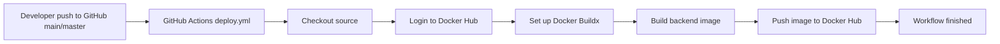

# CI/CD Pipeline

這份文件描述目前 `jd_matcher_ai` 專案的 GitHub Actions 流程。現在的架構已經是 CI-only，不包含任何自動部署，不會 SSH 進 server，也不會執行遠端 `docker compose`。

目標是讓後續開發者一眼看懂：

- 程式碼 push 後會發生什麼事
- GitHub Actions 目前只做到哪裡
- Docker Hub 在流程中的角色
- 哪些環境配置還需要事先準備
- 哪些事情現在還沒有被自動化

## 1. 目前流程目標

目前的流程是：

```text
git push to main/master
-> GitHub Actions
-> build Docker image
-> push image to Docker Hub
-> workflow 結束
```

這代表目前 pipeline 的責任只有：

- 自動驗證 GitHub Actions 能成功 build image
- 自動把最新 image push 到 Docker Hub

這代表目前 pipeline 不負責：

- SSH 到任何 server
- 連到 VPS
- 執行遠端 `docker compose pull`
- 執行遠端 `docker compose up -d`
- 自動更新正式或測試環境容器

## 2. 一眼看懂現在的 CI-only 架構



一句話總結：

`目前 GitHub Actions 只負責 build 與 push Docker image，部署仍是手動或未來再補。`

## 3. 目前實作完成的元件

### 3.1 GitHub Actions workflow

目前 workflow 檔案：

- `.github/workflows/deploy.yml`

目前 workflow name：

- `CI - Build and Push Docker Image`

目前只保留一個 job：

- `build-and-push`

### 3.2 Backend Docker image

目前 workflow 使用根目錄 `Dockerfile` 建立 backend image。

目前推送的 tag：

```text
<dockerhub_username>/jd-matcher-ai:latest
```

注意：

- 這裡使用的是 `jd-matcher-ai`，不是 `jd_matcher_ai`
- image 名稱已跟 workflow 設定一致

### 3.3 Docker Hub

Docker Hub 目前扮演的角色只有一個：

- 保存 GitHub Actions build 出來的最新 image

目前 workflow 成功後，Docker Hub 應該能看到新的：

- `<dockerhub_username>/jd-matcher-ai:latest`

## 4. GitHub Actions 實際執行流程

### 4.1 Trigger

觸發條件：

```yaml
on:
	push:
		branches:
			- main
			- master
```

也就是說，只要 push 到 `main` 或 `master`，workflow 就會啟動。

### 4.2 Step 1: Checkout source

使用：

- `actions/checkout@v4`

作用：

- 把 repository source code 取到 GitHub Actions runner
- 作為 Docker build context

### 4.3 Step 2: Login to Docker Hub

使用：

- `docker/login-action@v3`

使用的 secrets：

- `DOCKERHUB_USERNAME`
- `DOCKERHUB_TOKEN`

作用：

- 讓 runner 有權限 push image 到 Docker Hub

### 4.4 Step 3: Set up Docker Buildx

使用：

- `docker/setup-buildx-action@v3`

作用：

- 建立 Docker Buildx 環境
- 讓後續 image build/push 流程更穩定且符合標準做法

### 4.5 Step 4: Build and push backend image

使用：

- `docker/build-push-action@v6`

目前設定：

- build context: repository root
- push: `true`
- tag: `${{ secrets.DOCKERHUB_USERNAME }}/jd-matcher-ai:latest`

結果：

- workflow 成功後，最新 backend image 會被 push 到 Docker Hub

### 4.6 Step 5: Publish build summary

workflow 會把結果寫進 GitHub Actions summary，方便快速確認：

- Docker Hub login 成功
- backend image push 成功
- 目前沒有 deployment step

## 5. 明確移除的部署邏輯

這次 refactor 之後，以下內容都已經從 workflow 移除：

- `SERVER_HOST`
- `SERVER_USER`
- `SERVER_PORT`
- `SERVER_SSH_KEY`
- `SERVER_PROJECT_DIR`
- SSH action
- remote server commands
- 遠端 `docker compose pull`
- 遠端 `docker compose up -d`
- 任何 deploy job 或 deploy step

這表示目前 repository 的 GitHub Actions 不再依賴：

- VPS
- SSH 金鑰
- 遠端部署目錄
- 遠端 Docker Compose

## 6. 目前失敗條件

目前 workflow 會在以下情況失敗：

- `DOCKERHUB_USERNAME` 沒設
- `DOCKERHUB_TOKEN` 沒設
- Docker Hub login 失敗
- Docker image build 失敗
- Docker image push 失敗

這些失敗都屬於 CI 範圍內的合理失敗。

## 7. 目前日誌會顯示什麼

GitHub Actions logs 目前會清楚顯示：

- checkout 是否完成
- Docker Hub login 是否完成
- Buildx 是否完成初始化
- backend image 是否成功 build
- backend image 是否成功 push
- summary 是否完成

這已足夠支持目前的 CI-only 流程。

## 8. 跟目前系統架構的關係

這次改動沒有修改應用邏輯，也沒有改變系統分層。它只把原本包含 deploy 的 workflow 收斂成單純的 CI 流程。

所以目前狀態是：

- FastAPI backend 架構不變
- MySQL / Redis / Streamlit / Docker Compose 架構不變
- `system_design.md` 描述的應用內部分層不變
- 改變的只有 GitHub Actions 自動化範圍

換句話說：

- 應用本身仍可用 Docker Compose 啟動
- 但 GitHub Actions 目前只幫你產生並推送 image
- 不幫你自動把 image 套用到任何 server

## 9. 目前尚未做的環境配置

這一段列的是「為了讓目前 CI-only workflow 正常運作」還需要完成的設定。

### 9.1 GitHub Secrets

目前至少要設定：

1. `DOCKERHUB_USERNAME`
	 - Docker Hub 使用者名稱

2. `DOCKERHUB_TOKEN`
	 - Docker Hub access token
	 - 應具備 push image 權限

### 9.2 Docker Hub repository

目前需要確認 Docker Hub 上已存在或允許建立：

1. `jd-matcher-ai`

如果 repository 權限或命名不正確，workflow push 會失敗。

### 9.3 GitHub Repository 權限

需要確認目前 GitHub repository 有權限執行 Actions，且沒有被 branch policy 或 org policy 阻擋 Docker login / build / push。

### 9.4 Dockerfile 可持續維護

因為目前 workflow 是直接用根目錄 `Dockerfile` build image，所以後續如果調整 backend 執行環境，必須同步確認：

- `Dockerfile` 仍可成功 build
- build context 沒有被錯誤改壞
- image push 後仍可被正確使用

## 10. 目前沒有自動化的部分

以下事情現在仍未自動化：

- server deployment
- image rollout
- container restart
- remote health check
- rollback

如果未來要恢復 CD，再另外新增 deploy workflow 或 deploy job 會比較乾淨，不建議把 server 邏輯再混回目前這個 CI-only workflow。

## 11. 後續開發建議

如果下一步要強化目前 CI-only pipeline，建議順序如下：

1. 在 build 前加上測試步驟，例如 `pytest`
2. 為 image 增加 immutable tag，例如 commit SHA
3. 視需要再新增獨立 deploy workflow，而不是把 deploy 硬塞回現在這支 CI workflow

## 12. 一句話記住現在的架構

`現在的 GitHub Actions 只做 CI：build image、push 到 Docker Hub，沒有任何自動部署。`
- Docker Compose：負責編排 API、UI、MySQL、Redis、phpMyAdmin

