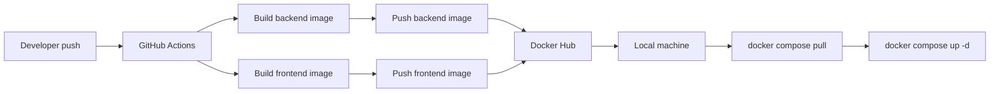

# CI/CD Pipeline（Current Architecture）

這份文件描述目前 `jd_matcher_ai` 專案的 **CI（GitHub Actions）+ Local CD（本機部署）** 架構。

目前已完成：

* ✅ GitHub Actions 自動 build backend + frontend images
* ✅ 自動 push 到 Docker Hub
* ✅ 本機可透過 `update.ps1` / `update.sh` 自動 pull + restart containers

---

# 1. 目前完整流程（CI + Local CD）

```text
git push to main/master
↓
GitHub Actions
↓
build backend image
↓
build frontend image
↓
push images to Docker Hub
↓
（本機）
update.ps1 / update.sh
↓
docker compose pull
↓
docker compose up -d
↓
containers restart
```

---

# 2. 一眼看懂架構



---

# 3. CI（GitHub Actions）

## 3.1 Workflow

檔案：

```text
.github/workflows/deploy.yml
```

---

## 3.2 觸發條件

```yaml
on:
  push:
    branches:
      - main
      - master
```

---

## 3.3 CI 做的事情

### Step 1：Checkout

```yaml
uses: actions/checkout@v4
```

---

### Step 2：Login Docker Hub

使用 secrets：

* `DOCKERHUB_USERNAME`
* `DOCKERHUB_TOKEN`

---

### Step 3：Build backend image

```text
<dockerhub_username>/jd_matcher_ai:latest
```

---

### Step 4：Build frontend image

```text
<dockerhub_username>/jd_matcher_ai_ui:latest
```

---

## 3.4 CI 的責任（很重要）

CI 只負責：

* build image
* push image

CI 不負責：

* 部署
* container restart
* SSH / server

---

# 4. Docker Hub

目前會有兩個 image：

```text
<dockerhub_username>/jd_matcher_ai
<dockerhub_username>/jd_matcher_ai_ui
```

---

CI 成功後應該看到：

```text
latest tag updated
```

---

# 5. Local CD（本機部署）

## 5.1 docker-compose.yml

```yaml
services:
  api:
    image: ian61236123/jd_matcher_ai:latest

  frontend:
    image: ian61236123/jd_matcher_ai_ui:latest

  mysql:
    image: mysql:8

  redis:
    image: redis:7
```

---

## 5.2 update script

### Windows（PowerShell）

```powershell
# update.ps1

Write-Host "Pull latest images..."
docker compose pull

Write-Host "Restart containers..."
docker compose up -d

Write-Host "Update complete!"
```

---

### Mac / Linux

```bash
# update.sh

docker compose pull
docker compose up -d
```

---

## 5.3 使用方式

```bash
./update.sh
```

或：

```powershell
.\update.ps1
```

---

## 5.4 發生什麼事

```text
docker compose pull → 從 Docker Hub 抓最新 image
docker compose up -d → 自動重建 container
```

---

# 6. 成功驗證方式

## 6.1 CI 是否成功

GitHub → Actions：

```text
✔ build-and-push 成功
```

---

## 6.2 Docker Hub

```text
latest updated time = 最新
```

---

## 6.3 本機

```bash
docker compose pull
```

應看到：

```text
Downloaded newer image
```

---

```bash
docker ps
```

應看到：

```text
api / frontend / mysql / redis running
```

---

# 7. 常見錯誤（重要）

## ❌ manifest not found

```text
原因：image 沒 push 或名稱不一致
```

---

## ❌ DOCKERHUB_USERNAME not set

```text
原因：docker-compose 使用 env，但本機沒有
```

👉 解法：

```text
直接寫死 image name（推薦）
```

---

## ❌ pull 沒更新

```text
原因：latest 沒變 or CI 沒成功
```

---

# 8. 架構設計原則（關鍵理解）

## 8.1 每個 service = 一個 image

```text
backend → jd_matcher_ai
frontend → jd_matcher_ai_ui
```

---

## 8.2 不要把 frontend + backend 放同一 container

原因：

* 無法獨立部署
* 無法擴展
* 不符合業界架構

---

# 9. 目前尚未做的（未來可擴展）

* 自動 deploy（CD）
* VPS / server 部署
* rollback 機制
* health check
* version tagging（非 latest）

---

# 10. 後續建議

建議優先順序：

1. image tag 加上 commit SHA
2. CI 加上測試（pytest）
3. 再導入正式 CD（SSH / VPS）

---

# 11. 一句話記住

```text
CI：build + push image
CD（現在）：手動 update.sh
```

---

# 12. TL;DR（最重要）

```text
git push → CI build → push Docker Hub
↓
手動執行 update.sh
↓
系統更新完成
```
