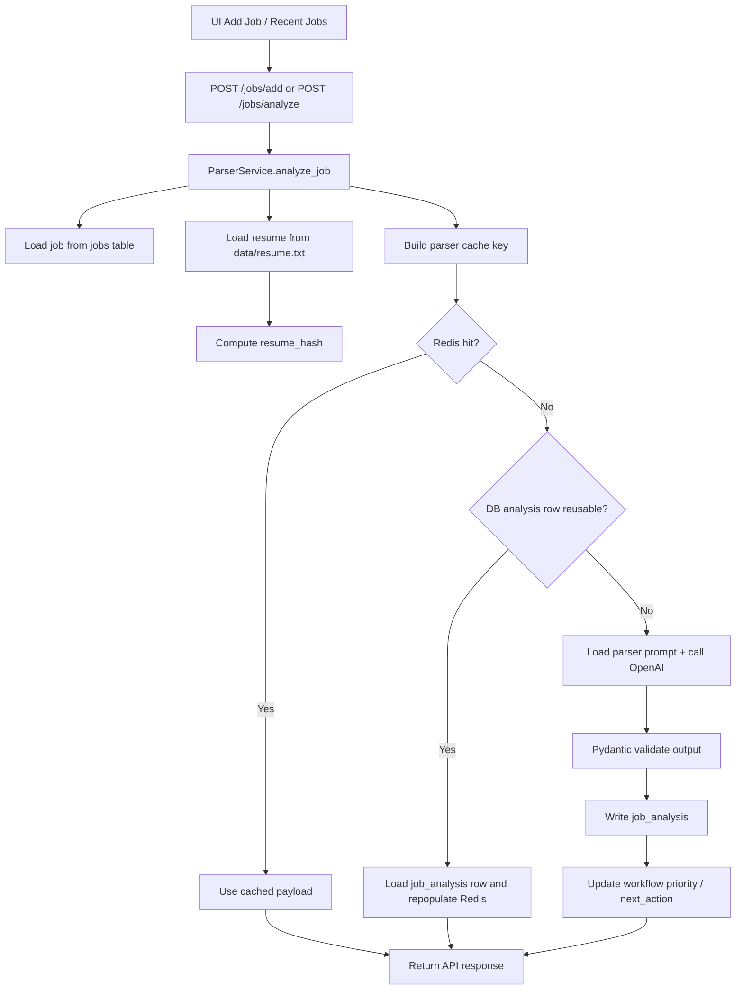
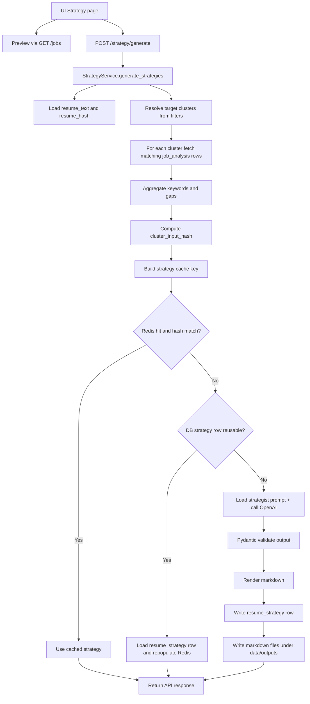

# Analysis Pipeline

這份文件描述目前 jd_matcher_v2 內真正運作中的兩條 AI pipeline：

- Parser pipeline：把單一職缺 JD 轉成結構化分析結果
- Strategy pipeline：把一批已分析職缺彙整成履歷策略建議

目標不是逐行解釋 code，而是讓後續優化 pipeline 時，能先快速掌握資料入口、filter 生效位置、快取策略、OpenAI 呼叫點，以及資料最後寫到哪裡。

## 1. Pipeline 在系統中的位置

- UI：Streamlit，多頁面入口在 `ui/pages/`
- API：FastAPI routers，在 `app/api/routers/`
- Business logic：service 層，在 `app/services/`
- DB：MySQL/SQLAlchemy models，在 `app/db/models/`
- Cache：Redis，透過 `app/services/cache_service.py`
- LLM：OpenAI Responses API，透過 `app/services/openai_client.py`
- Prompt：純文字 prompt 檔，放在 `app/prompts/`
- Resume：預設從 `data/resume.txt` 讀取

## 2. 共用資源與核心約定

### 2.1 Prompt 載入

- Parser prompt：`app/prompts/parser_prompt.txt`
- Strategy prompt：`app/prompts/strategist_prompt.txt`
- 兩條 pipeline 都是在 runtime 直接讀檔，不是把 prompt hardcode 在 Python 內。
- 這代表後續調 prompt 不需要改 service 程式，只要改 prompt 檔案即可。

### 2.2 Resume 載入

- 目前預設履歷檔案是 `data/resume.txt`
- 由 `app/services/resume_service.py` 負責讀取文字內容與計算 `resume_hash`
- `resume_hash` 會進入 parser 與 strategy 的 cache key，也會寫入資料表，作為版本隔離的一部分
- 如果本地沒有 `data/resume.txt`，系統仍保留 fallback 到 legacy `resume.txt` 路徑的能力

### 2.3 OpenAI 呼叫

- 統一由 `app/services/openai_client.py` 呼叫 OpenAI Responses API
- 兩條 pipeline 都要求 JSON schema 輸出
- OpenAI 回應會先經 schema 約束，再經 Pydantic model 驗證
- token usage 會寫入 `logs/openai_usage.txt`

目前 log 格式如下：

```text
YYYY-MM-DD HH:MM:SS parser gpt-4.1-mini 1234 321 1555
YYYY-MM-DD HH:MM:SS strategist gpt-4.1-mini 2345 654 2999
```

欄位依序是：

- timestamp
- pipeline type
- model
- input tokens
- output tokens
- total tokens

### 2.4 Redis 快取 key

- Parser：`parser_cache:{job_id}:{resume_hash}:{analysis_version}`
- Strategy：`strategy_cache:{cluster}:{company_token}:{min_score_token}:{resume_hash}:{analysis_version}`

設計重點：

- 同一份 JD，如果 resume 內容改了，cache 會自動 miss
- analysis_version 改動時，舊分析資料不會誤用
- Strategy 不只依 cluster 分流，也依公司與最低分數條件分流

## 3. Parser Pipeline

### 3.1 功能目的

Parser pipeline 的責任是把單一職缺 JD 轉成結構化分析結果，包括：

- cluster
- fit score
- must-have / nice-to-have / domain keywords
- top gaps
- screening risks
- recommended resume version
- priority 與 next action 所需的衍生資訊

### 3.2 UI 入口

目前有兩個主要入口會觸發 Parser：

1. `ui/pages/add_job.py`
	- 使用者貼上 JD、company、role title、url、notes
	- 勾選 `Analyze immediately after adding`
	- UI 呼叫 `POST /jobs/add`
	- 後端建立 job 後，若 `auto_analyze=true`，會直接跑 parser

2. `ui/pages/recent_jobs.py`
	- 使用者在 Recent Jobs 頁面點 `Run Parser`
	- UI 呼叫 `POST /jobs/analyze`，body 帶 `job_id` 與 `force=true`
	- 另外後端現在也支援 `POST /jobs/analyze/{job_id}`

### 3.3 Job 先怎麼進系統

當 UI 呼叫 `POST /jobs/add` 時：

1. FastAPI router `app/api/routers/jobs.py` 接收資料
2. `JobService.add_job()` 建立 `jobs` 資料列
3. 同時建立對應的 `workflow` 資料列，初始值大致如下：
	- `priority = P2`
	- `status = Backlog`
	- `next_action = Run parser analysis`
	- `applied = false`
4. 若 `auto_analyze=true`，router 會立刻呼叫 `ParserService.analyze_job()`

也就是說，Parser 不是直接接 UI 原始輸入，而是建立 job 後，以 `job_id` 為主鍵去讀取 JD 內容。

### 3.4 Parser 端到端流程



### 3.5 後端細節

`ParserService.analyze_job()` 的主要步驟如下：

1. 用 `job_id` 從 `jobs` 表讀出原始 JD
2. 用 `resume_service.load_resume_payload()` 讀出：
	- `resume_text`
	- `resume_hash`
3. 建立 parser cache key：

```text
parser_cache:{job_id}:{resume_hash}:{analysis_version}
```

4. 先查 Redis
5. Redis 沒命中時，再看 DB 是否已有同 `job_id + analysis_version` 的 `job_analysis`，且 `resume_hash` 一致
6. 若 DB 可重用，直接把 DB row 轉成 payload 並回填 Redis
7. 若 Redis/DB 都不能用，才呼叫 OpenAI

### 3.6 OpenAI 在 Parser 中吃到什麼資料

Parser 送進 OpenAI 的內容來自兩部分：

- system prompt：`app/prompts/parser_prompt.txt`
- user content：由 `build_user_content()` 組合

內容格式是：

```text
Resume (current):
<resume_text>

Job description:
<jd_text>
```

### 3.7 Parser 回傳後如何驗證與儲存

OpenAI 回傳 JSON 後，會經過兩層驗證：

1. OpenAI JSON schema：`app/prompts/schemas.py` 內的 `PARSER_SCHEMA`
2. Pydantic model：`app/schemas/ai.py` 內的 `ParserAIResult`

驗證成功後會寫入：

- `job_analysis` 表
  - `cluster`
  - `fit_score`
  - `years_required`
  - `cluster_reason`
  - `must_have_keywords`
  - `nice_to_have_keywords`
  - `domain_keywords`
  - `top_gaps`
  - `screening_risks`
  - `recommended_resume_version`
  - `resume_tweak_suggestions`
  - `resume_hash`
  - `analysis_version`

- `workflow` 表
  - `priority`
  - `next_action`
  - 若尚未 applied，會依新的 priority 更新 `next_action`

Priority 是 parser 後端根據規則計算，不是 OpenAI 直接輸出。主要依據：

- fit_score
- years_required
- top_gaps 數量

### 3.8 Parser 回應怎麼被 UI 使用

`GET /jobs` 會把 `jobs + job_analysis + workflow` 組成 dashboard row，回傳給 UI。UI 常用欄位包括：

- company
- role_title
- analysis.cluster
- analysis.fit_score
- analysis.top_gaps
- workflow.priority
- workflow.applied

Recent Jobs 頁面用這些欄位做列表、統計和操作按鈕。

### 3.9 Parser 相關 filter 在哪裡生效

Recent Jobs 的 filter 不是在 parser 執行當下生效，而是在查詢已存在 jobs/analysis 時生效。

UI 在 `ui/helpers.py` 內把條件轉成 `GET /jobs` 參數：

- `company`
- `cluster`
- `min_score`
- `applied`
- `limit`

後端 `JobService.list_jobs()` 會在 SQL 查詢中套用：

- company filter
- cluster filter
- min_score filter
- applied filter
- priority / status filter 如果 API 有帶

也就是說：

- Parser 本身處理單一 job
- Job list filter 用來決定 UI 現在看到哪一些 job

## 4. Strategy Pipeline

### 4.1 功能目的

Strategy pipeline 的責任不是分析單一 JD，而是把一批已經做完 parser 的 job_analysis 聚合起來，輸出：

- cluster summary
- 建議使用的 resume variant
- positioning sentence
- keyword additions
- ready-to-paste bullets
- checklist
- markdown 版策略文件

### 4.2 UI 入口與 filter 來源

Strategy 頁面在 `ui/pages/strategy.py`。

使用者在 UI 設定：

- cluster
- company
- minimum score
- applied status

UI 會先用同一組條件呼叫 `GET /jobs` 做 preview，讓使用者知道目前有哪些職缺會被納入。

接著 UI 按下 `Generate Strategy` 時，會呼叫 `POST /strategy/generate`。實際送出的 payload 由 `ui/helpers.py` 組成，內容大致如下：

```json
{
  "cluster": "all | A | B | C1 | C2",
  "filter_company": null | "company name",
  "filter_min_score": 0..100,
  "applied": "All | Applied | Not Applied"
}
```

注意：

- UI 傳的是 `applied`
- 後端 schema 會用 alias 把它接成 `applied_status`

### 4.3 Strategy 端到端流程



### 4.4 Strategy filter 在哪一層生效

Strategy pipeline 的 filter 是真正進 SQL 查詢的，不只是 UI 顯示條件。

`StrategyService` 會接收：

- `cluster`
- `filter_company`
- `filter_min_score`
- `applied_status`

然後分兩段使用：

1. `_get_target_clusters()`
	- 如果 cluster 指定為某一群，直接只跑那一群
	- 如果 cluster 是 `all`，就先去 DB 查在目前 filter 下有哪些 cluster 有資料

2. `_fetch_analysis_rows()`
	- 真正把該 cluster 下符合條件的 `job_analysis` rows 撈出來

目前 strategy 生成時，filter 會套在 SQL 上：

- `JobAnalysis.cluster`
- `Job.company`
- `JobAnalysis.fit_score >= filter_min_score`
- `Workflow.applied == True/False`

因此現在 `Applied / Not Applied` 已經是後端真正生效的 filter，不再只是 UI preview。

### 4.5 Strategy 用到哪些資料表

Strategy 不直接吃原始 JD 文字，而是吃 parser 之後的結構化資料。

主要資料來源：

- `job_analysis`
- `jobs`
- `workflow`

這三個表 join 後，用來取得：

- cluster
- fit_score
- must_have keywords
- domain keywords
- top_gaps
- recommended resume version
- company
- applied status

### 4.6 Strategy 聚合邏輯

在呼叫 OpenAI 前，後端會先自己做 deterministic aggregation：

- 計算 top must-have keywords
- 計算 top domain keywords
- 計算 top gaps

這部分由 `aggregate_keywords()` 完成，輸出會變成 cluster summary，作為 OpenAI 的輸入之一。

### 4.7 OpenAI 在 Strategy 中吃到什麼資料

Strategy 送進 OpenAI 的內容來自：

- system prompt：`app/prompts/strategist_prompt.txt`
- user content：一段 JSON 字串，主要包含
  - 截斷後的 resume 文字
  - cluster
  - resume_variant
  - top_must_haves
  - top_domains
  - top_gaps

這裡有一個重要設計：

- Strategy 不把所有 JD 原文直接丟給 OpenAI
- 它先用 parser 產生結構化資訊，再做聚合，再把摘要餵給 OpenAI

這樣可以降低 token、減少輸入噪音，也比較容易做 cache 與版本控制。

### 4.8 Strategy 回傳後如何驗證與儲存

OpenAI 回應後同樣會經過兩層驗證：

1. OpenAI JSON schema：`STRATEGIST_SCHEMA`
2. Pydantic model：`StrategistAIResult`

驗證成功後，後端會：

1. 用 `render_strategy_markdown()` 組出最終 markdown
2. 寫入 `resume_strategy` 表
3. 寫入 `data/outputs/` 下的 markdown 檔

`resume_strategy` 主要保存：

- `cluster`
- `resume_variant`
- `cluster_summary`
- `resume_plan_md`
- `resume_hash`
- `analysis_version`
- `cluster_input_hash`
- `filter_company`
- `filter_min_score`
- `output_filename`

### 4.9 Strategy 快取與重用規則

Strategy 比 parser 多一層輸入一致性檢查：`cluster_input_hash`

這個 hash 會根據以下資料生成：

- cluster
- resume_variant
- resume_hash
- analysis_version
- filter_company
- filter_min_score
- 這次納入的 job_analysis rows 內容

因此就算 Redis key 一樣，只要底下被納入的分析資料有變，`cluster_input_hash` 不一致時就不會重用舊策略。

重用順序如下：

1. 先查 Redis
2. Redis 命中但 `cluster_input_hash` 不一致，視為不可用
3. 再查 `resume_strategy` 表中是否有可重用結果
4. 都沒有才呼叫 OpenAI

### 4.10 Strategy 輸出檔案

每次 strategy 生成後，會落地到 `data/outputs/`：

- 單一 cluster 檔：`strategy_{cluster}_{company?}_{score?}.md`
- 索引檔：`strategy_INDEX_{company?}_{score?}.md`

這些檔案是給人直接閱讀的輸出，不是系統唯一真實來源。真正可重用的資料仍在 DB 與 Redis。

## 5. 目前兩條 Pipeline 的資料流總結

### 5.1 Parser

```text
UI 輸入 JD
-> POST /jobs/add 或 POST /jobs/analyze
-> jobs / workflow 建立或讀取
-> 載入 resume.txt
-> Redis / DB 快取判斷
-> OpenAI 結構化分析
-> 寫入 job_analysis
-> 更新 workflow priority / next_action
-> GET /jobs 回 UI 顯示
```

### 5.2 Strategy

```text
UI 選 cluster/company/min_score/applied
-> GET /jobs 做 preview
-> POST /strategy/generate
-> 載入 resume.txt
-> 用 filter 查 job_analysis + workflow + jobs
-> 聚合 keywords/gaps
-> Redis / DB 快取判斷
-> OpenAI 產生 strategy
-> 寫入 resume_strategy
-> 寫 markdown 到 data/outputs
-> 回傳 section_md 給 UI 顯示
```

## 6. 後續優化時建議先看的檔案

若要調整 parser pipeline，優先看：

- `ui/pages/add_job.py`
- `ui/pages/recent_jobs.py`
- `app/api/routers/jobs.py`
- `app/services/parser_service.py`
- `app/services/resume_service.py`
- `app/services/openai_client.py`
- `app/services/cache_service.py`

若要調整 strategy pipeline，優先看：

- `ui/pages/strategy.py`
- `ui/helpers.py`
- `app/api/routers/strategy.py`
- `app/services/strategy_service.py`
- `app/services/openai_client.py`
- `app/services/cache_service.py`

## 7. 維護時最容易踩到的點

- 不要把 prompt 寫死進程式，現在設計是假設 prompt 可獨立調整
- 不要忽略 `resume_hash`，否則換履歷後容易誤吃舊 cache
- 不要只改 UI filter 而不改 service SQL，否則 preview 與真正生成結果會不一致
- `GET /strategy` 目前主要用來載入既有策略，查詢條件以 cluster/company/min_score 為主；真正的 `applied_status` 過濾是在 `POST /strategy/generate` 生成流程中生效
- `data/outputs` 是輸出層，不是唯一資料來源；要查真實狀態優先看 DB 和 Redis

## 8. 一句話記住這個架構

- Parser 是「單筆 JD -> 結構化分析 -> job_analysis/workflow」
- Strategy 是「多筆 job_analysis + filter -> 聚合摘要 -> OpenAI 履歷策略 -> resume_strategy/markdown」
